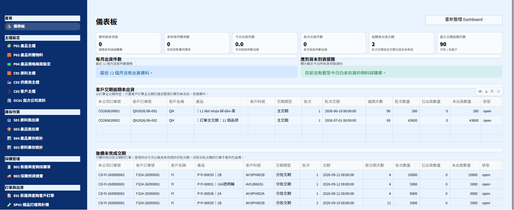

# OrdoLite ERP｜製造業ERP導入案例

> 以製造現場實際流程為核心，整合訂單、採購、庫存、出貨與應收應付作業。
> 本案例已匿名處理，畫面與資料均不包含客戶機密資訊。

## 專案簡介

OrdoLite ERP 是我針對中小型製造業需求規劃與開發的輕量ERP系統。

本專案起點從會計、採購、倉儲與管理端的日常作業出發，將分散的Excel紀錄、人工核對與跨部門溝通流程，逐步整合為可追蹤、可查詢、可管理的系統。

系統已完成實際部署、使用者教育訓練及上線後維護，供多台電腦於同一網路環境下使用。

## 專案目標

* 整合客戶、供應商、品項、訂單與庫存資料
* 降低人工登打、重複核對與帳務追蹤的負擔
* 讓採購、入庫、出貨、應收與應付資料可以互相連動
* 建立操作紀錄與權限控管，提升資料正確性
* 提供中文、英文、越文介面，支援跨語言使用者

## 我的角色

* 訪談會計、採購及管理端需求
* 觀察客戶目前作業流程碰到的痛點，並製作交期提醒、物料到貨提醒等管理工具
* 梳理實際作業流程與資料欄位
* 規劃資料庫結構與系統規則
* 使用 Python、Streamlit 與 MySQL 開發系統
* 執行測試、現場部署與使用者教育訓練
* 建立備份與遠端維護機制
* 依使用者回饋持續調整功能與介面

## 核心功能

| 模組    | 功能說明                  |
| ----- | --------------------- |
| 主檔管理  | 客戶、供應商、品項及基礎資料維護      |
| 銷售與訂單 | 訂單建立、訂單明細與待出貨追蹤       |
| 採購管理  | 採購資料建立與預計到貨管理         |
| 庫存管理  | 入庫、出庫、庫存查詢及異動紀錄       |
| 出貨管理  | 客戶訂單選取、車號登錄、出貨明細與庫存扣減 |
| 應收應付  | 應收、應付、對帳與批次收付款        |
| 權限與稽核 | 使用者帳號、操作紀錄、建檔與修改時間追蹤  |
| 多語介面  | 中文、英文、越文切換            |

## 系統規則與資料控管

為避免ERP資料在日常操作中失真，系統設計了基本控管規則：

* 已收款或已付款的資料不可任意刪除
* 數量為零的資料不可建立
* 重要資料保留建檔者、修改者及時間紀錄
* 出貨資料會連動庫存異動
* 透過權限與操作紀錄，降低資料被誤改後無法追查的風險

## 導入與部署成果

* 完成從需求訪談、開發、測試、部署到教育訓練的完整導入循環
* 支援多台電腦於同一網路環境下同時使用
* 建立每日備份機制，降低營運資料遺失風險
* 提供遠端維護方式，支援後續問題排除與功能調整
* 現場使用者可依實際流程完成入出庫、帳款與資料查詢作業

## 技術架構

* **前端與操作介面：** Streamlit
* **後端邏輯：** Python
* **資料庫：** MySQL
* **部署環境：** Windows 區域網路環境
* **維護方式：** 每日備份與遠端支援

## 畫面展示

> 以下畫面均為展示用途，已移除或替換客戶、品項、交易與人員等敏感資料。

### 系統儀表板

### 出貨作業

### 應收應付與帳款管理

### 條碼入庫

## 線上展示

> 展示版將使用假資料，與正式客戶環境完全分離。

* 線上Demo：`準備中`
* 操作影片：`準備中`

## 我從本專案累積的能力

這個專案讓我累積的不只是開發經驗，而是製造業ERP導入所需要的實務能力：

* 將現場口語需求轉換為可執行的系統流程
* 理解會計、採購、倉儲與管理端對資料的不同需求
* 在功能、資料正確性與使用便利性之間取得平衡
* 將系統導入實際使用環境，並協助使用者改變既有作業習慣
* 以製造現場經驗協助系統設計貼近真實工作流程

---

**求職定位：ERP顧問／製造業數位轉型／系統導入專案管理**

如需了解系統設計、流程規劃或展示版操作方式，歡迎於面談時進一步交流。
