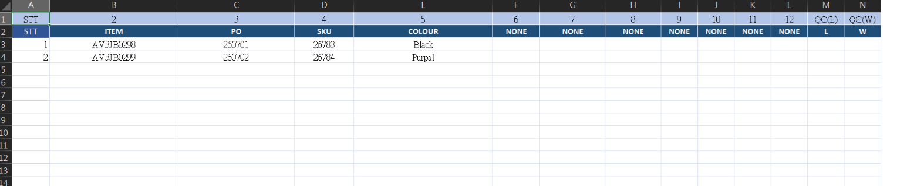
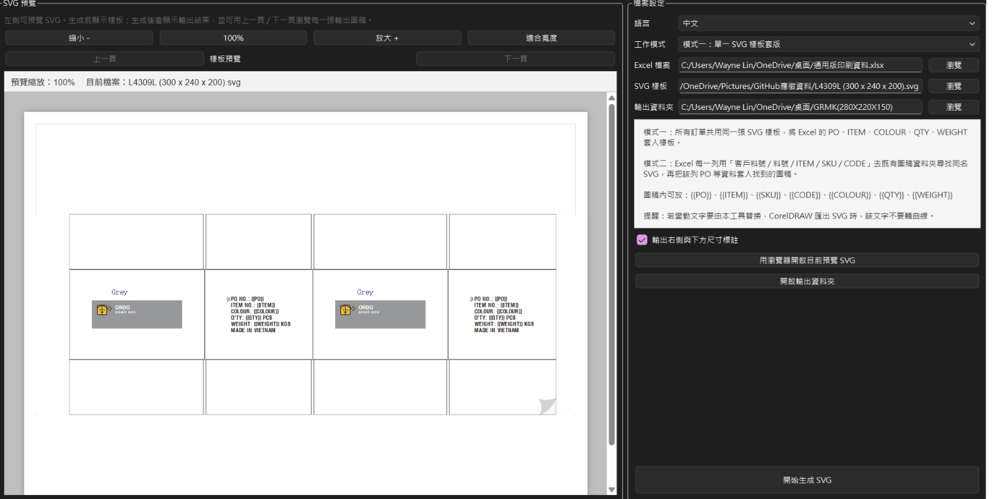
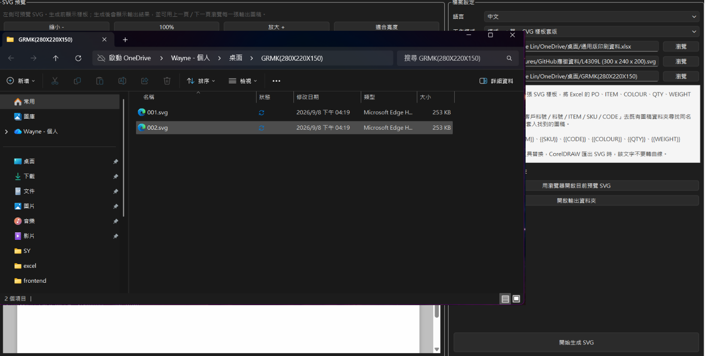

# Ordo Print Mapping｜紙箱印刷檔案批次自動化

> 將Excel中的訂單與印刷資料，依既定規則轉換為可使用的SVG印刷圖檔，降低人工修改嘜頭與反覆製檔的時間。

## 專案簡介

在紙箱製造現場，常見同一個客戶因出口地區、產品顏色、批號、SKU的不同，要求紙箱廠製作同規格、同Logo，但PO、SKU、COLOUR等印刷不同的紙箱。

若以人工方式逐一開啟檔案、修改文字、另存與確認，容易耗時，也容易發生漏改、改錯版本或檔名對應錯誤等問題。

Ordo Print Mapping 是我設計的批次自動化工具：使用者整理Excel資料後，系統依照欄位對應與模板規則，自動產生SVG印刷檔案。

## 專案目標

* 將重複性的印刷資料修改流程標準化
* 減少人工逐檔修改文字與嘜頭內容的時間
* 降低檔名、訂單與印刷內容對應錯誤的風險
* 建立未來與ERP訂單、印刷版號及版本管理串接的基礎

## 我的角色

* 盤點紙箱印刷資料與實際製檔流程
* 定義Excel欄位、命名規則與輸出規則
* 設計資料轉換與模板對應邏輯
* 使用Python建立Excel至SVG的批次產生工具
* 協助設計端測試輸出結果與調整使用流程

## 核心功能

| 功能        | 說明                      |
| --------- | ----------------------- |
| Excel資料匯入 | 讀取訂單、客戶、品名、規格、印刷文字等欄位   |
| 欄位對應      | 將Excel資料對應至既有印刷模板中的指定位置 |
| SVG批次輸出   | 依每筆資料自動產生對應的SVG印刷圖檔     |
| 檔名規則      | 依訂單、料號或指定規則產生檔名，方便追溯    |
| 批次合併      | 支援多個圖檔整併為6-in-1輸出格式     |
| 資料檢查      | 協助檢查必要欄位，降低因資料缺漏造成的輸出錯誤 |
| 多語言切換    | 方便台灣主管、越籍設計與印刷車長能無礙使用  |

## 實際效益

在一次147筆資料的批次印刷嘜頭製作：

| 作業項目         |    所需時間 |
| ------------ | ------: |
| 整理與核對Excel資料 | 約30分鐘 |
| 系統批次產生SVG檔案  |     約2秒 |

原本數位印刷機車長或設計人員需要花4個小時以上更改SKU、COLOUR、PO等產品資訊，這套軟體將原本需人力重複製作的過程壓縮至30分種左右，
也將原本依賴人工逐筆修改的流程，改為可重複執行、可檢查、可追溯的標準作業。

## 使用流程

```text
整理Excel資料
      ↓
選擇印刷模板與欄位規則
      ↓
執行批次轉換
      ↓
產生SVG圖檔
      ↓
檢查輸出結果後交付設計／印刷使用
```

## 技術與資料格式

* **開發語言：** Python
* **輸入資料：** Excel
* **輸出格式：** SVG
* **資料處理：** pandas
* **主要應用：** 紙箱嘜頭、印刷文字與訂單資料的批次轉換

## 畫面展示

> 下列畫面與資料均為展示用途，已移除客戶名稱、訂單編號及其他敏感資訊。

### Excel欄位與資料整理



### 批次產生設定



### SVG輸出結果



## 專案延伸方向

* 與ERP訂單資料直接串接，減少人工匯出與整理
* 串接印刷料號、印版／柔版編號與版本管理
* 結合 Ordo Print Editor，讓使用者可在產生後進一步調整圖稿
* 建立輸出紀錄與覆核流程，提升印刷資料可追溯性

---


